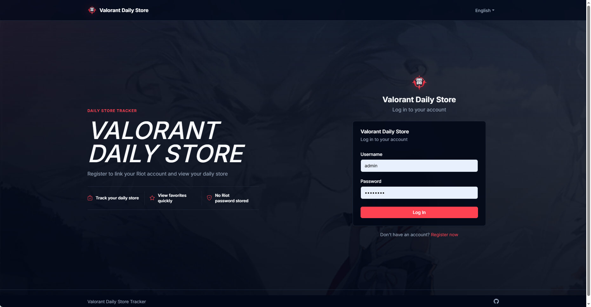
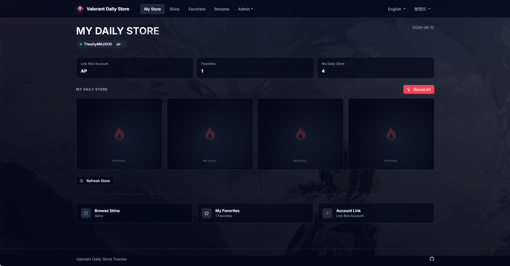
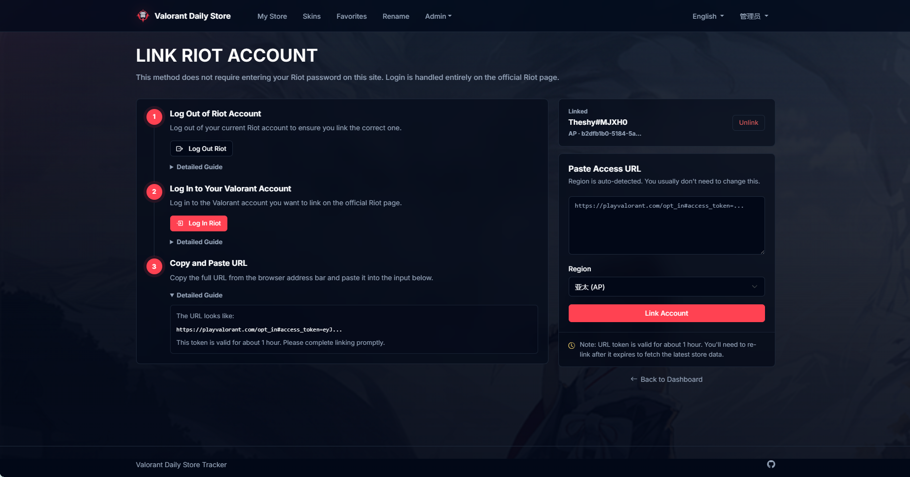
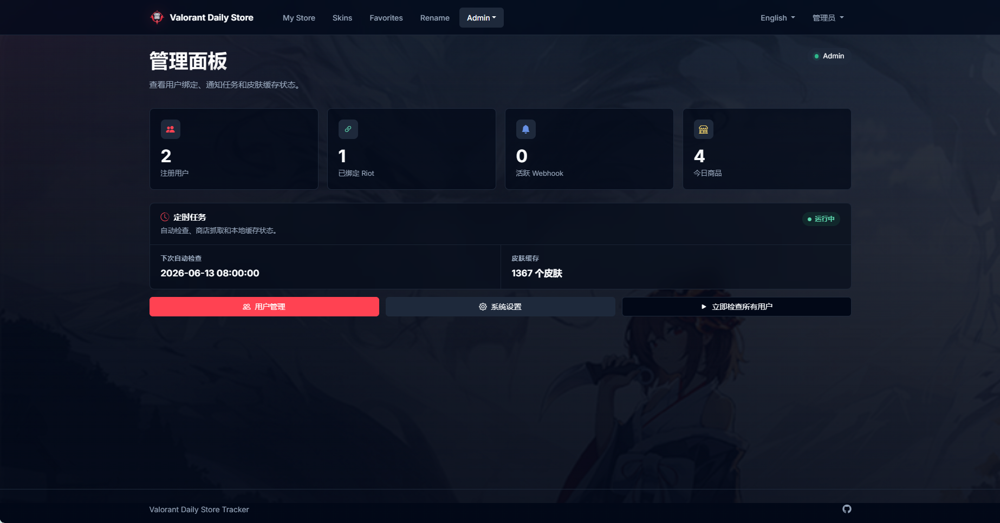
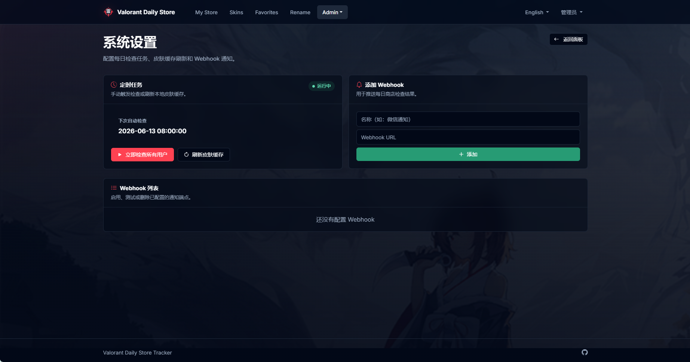

# RadiantShelf

一个基于 Flask 的 Valorant 每日商店查看与推送工具。用户注册后可以通过 Riot 官方登录页面获取短期 Access URL，绑定账号并查看当天商店；管理员可以维护 Webhook、手动检查用户商店、刷新皮肤缓存。

## 功能特性

- 用户注册、登录、退出
- Riot 账号 URL Token 绑定，无需在本站输入 Riot 密码
- 获取并展示每日商店 4 个皮肤报价
- 翻牌式商店卡片展示，支持一键 Reveal All
- 皮肤图库搜索、收藏和多语言名称展示
- 每日定时检查商店，支持全局 Webhook 推送
- 管理后台：概览面板、用户管理、Webhook 管理、手动检查、皮肤缓存刷新
- 多语言界面：中文、英文、日文、韩文、葡萄牙文、西班牙文、土耳其文、俄文

## 界面截图

### 登录页



### 我的商店



### Riot 账号绑定页



### 管理面板



### 系统设置 / Webhook



## 技术栈

- Python 3.10+
- Flask 3.1
- Flask-SQLAlchemy
- Flask-Login
- APScheduler
- SQLite
- Bootstrap 5 + Bootstrap Icons

## 项目结构

```text
.
├── app.py                 # Flask 应用工厂与路由
├── run.py                 # 本地启动入口
├── config.py              # 配置、区服映射、Fernet 密钥加载
├── models.py              # SQLAlchemy 数据模型
├── riot_auth.py           # Riot Access URL 解析与授权
├── store_api.py           # Valorant 商店接口调用与解析
├── skin_cache.py          # 皮肤缓存刷新、搜索与本地化
├── scheduler.py           # 每日检查与每周缓存刷新任务
├── webhook.py             # Webhook 推送逻辑
├── static/style.css       # 全局 UI 样式
├── templates/             # Jinja 页面模板
└── translations/          # 多语言文案
```

## 快速开始

### 1. 创建虚拟环境

```powershell
py -3 -m venv .venv
.\.venv\Scripts\Activate.ps1
```

### 2. 安装依赖

```powershell
pip install -r requirements.txt
```

### 3. 配置环境变量

复制 `.env.example` 作为参考。项目不会自动读取 `.env` 文件，本地运行时请在当前终端设置环境变量，或在部署平台的环境变量面板中配置。

```powershell
$env:SECRET_KEY="replace-with-a-long-random-secret"
$env:FERNET_KEY="replace-with-a-fernet-key"
$env:SESSION_COOKIE_SECURE="true"
$env:ADMIN_USERNAME="admin"
$env:ADMIN_PASSWORD="replace-with-a-strong-admin-password"
$env:CHECK_HOUR="8"
$env:CHECK_MINUTE="0"
$env:TIMEZONE="Asia/Shanghai"
```

生成 Fernet Key：

```powershell
python -c "from cryptography.fernet import Fernet; print(Fernet.generate_key().decode())"
```

如果没有设置 `FERNET_KEY`，应用会在项目根目录生成 `fernet.key`。这个文件用于解密已保存的 Riot Access Token，必须妥善备份，不能提交到公开仓库。

### 4. 启动应用

```powershell
python run.py
```

访问：

```text
http://127.0.0.1:5000
```

首次启动会自动创建数据库表。如果没有管理员账号，应用会使用
`ADMIN_USERNAME` 和 `ADMIN_PASSWORD` 创建管理员。生产或共享部署前必须设置强密码。

仅本地开发时，可以设置 `ALLOW_DEFAULT_ADMIN=true` 来创建默认管理员
`admin / admin123`。不要在公网环境启用这个选项。

## 使用流程

1. 注册并登录站内账号。
2. 进入“绑定 Riot 账号”。
3. 按页面指引先退出 Riot，再打开 Riot 官方授权页面登录。
4. 登录后复制浏览器地址栏中的完整 URL。
5. 将 URL 粘贴到绑定页面并提交。
6. 返回“我的商店”，点击“获取今日商店”或等待定时任务刷新。

说明：

- Access URL 中的 token 通常只在短时间内有效，代码中按约 55 分钟处理。
- token 过期后需要重新绑定，才能继续刷新商店。
- 区服会尽量自动检测；手动选择仅作为备用。

## 管理后台

管理员登录后可以访问顶部“管理”菜单：

- 管理面板：查看用户数、绑定数、Webhook 数、今日商品数和下次任务时间。
- 用户管理：删除用户、切换管理员权限。
- 系统设置：手动检查所有用户、刷新皮肤缓存、添加/测试/禁用/删除 Webhook。

定时任务默认：

- 每天 `CHECK_HOUR:CHECK_MINUTE` 检查所有已绑定用户。
- 每周一 04:00 刷新皮肤缓存。

定时任务只在 Flask 进程运行期间生效。如果使用多进程部署，需要避免多个进程重复执行同一任务。

## Webhook

后台添加的 Webhook 会在每日检查成功后收到 JSON 数据。核心字段包括：

```json
{
  "event": "daily_store",
  "user": "display name",
  "region": "ap",
  "timestamp": "2026-04-28T08:00:00",
  "offers": [],
  "favorites_matched": []
}
```

如果 Webhook 测试失败，请检查 URL 是否可公网访问、服务端是否接受 JSON POST、是否有签名或鉴权要求。

## 数据与密钥

本项目默认使用 SQLite：

- `store.db`：用户、皮肤缓存、收藏、商店记录、Webhook 配置
- `fernet.key`：本地加密密钥

这些文件不应该提交到公开仓库。上线前建议：

- 设置强随机 `SECRET_KEY`
- 固定并备份 `FERNET_KEY`
- 设置 `ADMIN_USERNAME` 和强随机 `ADMIN_PASSWORD`
- HTTPS 部署时设置 `SESSION_COOKIE_SECURE=true`
- 仅在确实需要推送到内网服务时设置 `ALLOW_PRIVATE_WEBHOOKS=true`
- 关闭 Flask debug
- 使用 HTTPS
- 限制管理后台访问范围
- 定期备份数据库

## 常见问题

### 绑定成功但刷新商店失败

常见原因是 token 过期、Riot 授权异常、区服识别失败或接口限流。重新绑定一次通常可以恢复。

### 皮肤列表为空

首次启动或缓存过期时会访问 `valorant-api.com` 拉取皮肤数据。可以在后台点击“刷新皮肤缓存”，并确认服务器可以访问外网。

### 提示 401 或 403

登录凭据已失效，请重新绑定 Riot 账号。

### Webhook 没有收到消息

确认至少有一个 Webhook 处于启用状态，并且每日检查没有因为用户 token 过期而失败。

### 修改 Fernet Key 后无法解密旧 token

这是预期行为。旧 token 是用旧密钥加密的，修改密钥后需要用户重新绑定。

## 部署建议

开发环境可以直接使用 `python run.py`。生产环境建议使用成熟的 WSGI 服务托管 Flask 应用，并设置环境变量：

```text
SECRET_KEY
FERNET_KEY
SESSION_COOKIE_SECURE
ADMIN_USERNAME
ADMIN_PASSWORD
CHECK_HOUR
CHECK_MINUTE
TIMEZONE
```

不要在公网环境启用 `ALLOW_DEFAULT_ADMIN` 或 Flask debug 模式。

## 免责声明

本项目仅用于个人学习和自托管工具场景，不隶属于 Riot Games。请遵守 Riot Games 的服务条款，并自行承担使用非官方接口带来的可用性风险。
